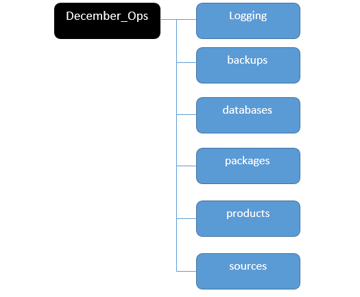

# December_Ops
This is a collection of utilities for operations in that cold cold month.
This is a work in progress held together with twine, duct tape and paperclips.

The primary focus is on: 
- parsing L2F database exports (in the form of a .csv file)
- populating local database with geocoded address data
- sorting households into routes and storing that route information in a database
- creating the paper artifacts necessary for deliveries (route cards, route binder sheets etc)
- handling sponsor requests and outputting custom reports for them to use in service delivery

## Project Structure			

Configuration data is in the config.yml file.  An example of fields is in the sample.yml file.

## How to use

### Step 1

The first thing to do is to build up an address database.   This step verifies the integrity of the input addresses and identifies problematic addresses at the outset, rather than the delivery phase. This is a bit of an ugly process and the main thing to pay attention to is the meta_error.log file

The source csv file(s) need to be processed first by the **address_parser_and_geocoder.py** script

source csv files should be stored in the sources file.   When run, the script will prompt the user to choose which file to use.  Alternatively, the file can be pointed to in the setup.yml config file

Next, the **gift_appointment_auto_generator.py** should be run after inputting updated SA related parameters in the setup.yml file

### Step 2

After scrutinizing the log files, it is important to correct the source addresses that are identified as having errors.  This could be missing directions, incorrect post types (Street instead of Avenue etc.) and other similar problems.  After making the necessary corrections and tracking down applicants to clarify address info, and re-running the scripts, you can move on to step 3

### Step 3

At this point the address database should contain all the potential applicant addresses and their geo coordinates.

At this point, run **ops_sort.py** to sort households into routes, and to log service requests for partners.  This will provision the route database.  This can be done in one go, or in batches as files are geocoded, amended and processed again.   Households are sorted through brute force, since cpu cycles are cheap and I'm not in a hurry. 

### Step 4 

Once the necessary files have been processed and the route database has been setup and filled with routes, reports and route cards can be printed.

ops_print_routes.py

ops_print_sponsor.py

will create route cards, delivery binder sheets, operations reference files and sponsor reports.  Sponsor reports can be printed according to a date range, so that late stage additions can be printed out without having to print the entire run and trying to figure out when and where

Files are output in the products/ folder and will be date and time stamped.  File names are also formatted with strings coded in the config.yml file.

## Areas for improvement

- Logging is a hot mess
- Object methods have confusingly similar names.  They need to be rewritten after several nights good sleeping and a few pots of coffee
- The address parsing pipeline is a total shambles and scrambles my brains a bit when I try and contemplate their cyclopean geometries 

